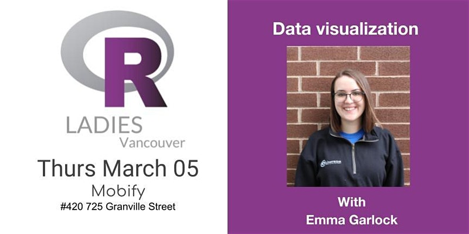

# Intro to ggplot with RLadies Vancouver 
## Presented by: Emma Garlock 

### twitter: [@emmagarlock](https://twitter.com/emmagarlock) 
### email: egarlock@sfu.ca

Hello! Here you will find the resources for my intro to ggplot workshop with the RLadies Vancouver. 
Before you arrive at the workshop, please make sure you have downloaded R. It will also be helpful if you have these packages already installed. Only `ggplot` is 100% required, but the others are nice to have if you feel like following along with the more complex examples I have at the end :). 
  * `ggplot` 
  * `tidyverse` 
  * `here` 
  * `igraph`
  * `ggnetwork` 

All these materials are in R notebook format, if you are not familiar with this format check [this](https://bookdown.org/yihui/rmarkdown/notebook.html) out. 

* [Fill in the blank script](https://github.com/esgarlock/rladiesmar2020/blob/master/fill_in_scripts/fill_in_the_blank.Rmd)
* [Completed Script](https://github.com/esgarlock/rladiesmar2020/blob/master/complete_scripts/ggplot_intro_besthits.html)
* [Scatter plot data](https://github.com/esgarlock/rladiesmar2020/blob/master/data/scatter.csv)
* [Bar plot data](https://github.com/esgarlock/rladiesmar2020/blob/master/data/bar_plot.csv)
* [Density plot data](https://github.com/esgarlock/rladiesmar2020/blob/master/data/denisty.csv)
* [Emma's example 1](https://github.com/esgarlock/rladiesmar2020/blob/master/data/my_example.csv)
* [Emma's example 2](https://github.com/esgarlock/rladiesmar2020/blob/master/data/net.csv)

## Other Resources 
* [The R Graph Gallery](https://www.r-graph-gallery.com/)
* [Top 50 ggplot2 Visualizations](http://r-statistics.co/Top50-Ggplot2-Visualizations-MasterList-R-Code.html)
* [One dataset visualized 25 ways](https://flowingdata.com/2017/01/24/one-dataset-visualized-25-ways/)
* Fun People to follow on twitter
  + [RLadies Global](https://twitter.com/RLadiesGlobal)
  + [RLadies Vancouver](https://twitter.com/RLadiesVan)
  + [Hadley Wickham](https://twitter.com/hadleywickham)
  + [Sharla Gelfand](https://twitter.com/sharlagelfand)
  + [Laura Ellis](https://twitter.com/LittleMissData)
 
